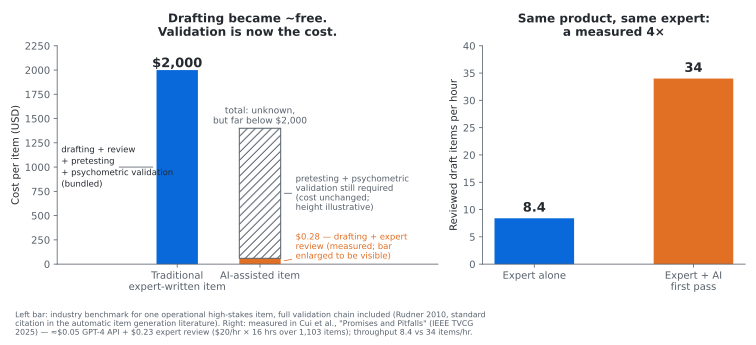
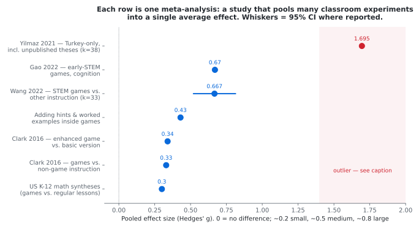
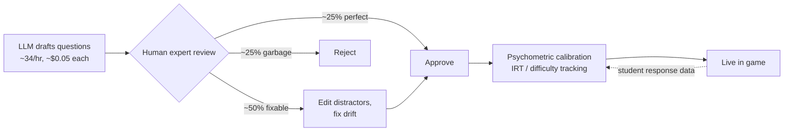

# coolmathgames2.0

A thesis, and eventually an engine, for **teaching games in the post-AI tutoring market**: constrained LLM generation poured into pedagogically load-bearing game templates.

---

## The market read: tutoring after AI

"Post-AI" didn't kill tutoring — it **bifurcated** it. The industry split along a single fault line: *was the tutor selling knowledge, or something else?*

### What died: answer-arbitrage

**Answer-arbitrage** (a coinage, not a standard term) is the business model where you charge for access to answers that are expensive to produce once but cheap to serve at scale. Chegg is the canonical example — pay experts to solve textbook problems once, then sell the stored solution to thousands of students at ~$15/mo. The arbitrage is the gap between one-time production cost and aggregate subscription revenue, protected only by the paywall around the answer bank.

LLMs vaporized this. Once the marginal cost of *generating* a fresh answer dropped below the cost of *retrieving* a stored one, the "we already have the answers" moat became worthless. Chegg is the corpse of record (~99% off its peak, subscribers in freefall since 2023). The same structural collapse hit Stack Overflow's traffic and is chewing on Quora — anywhere the asset was a static corpus of Q&A pairs.

### What's holding: everything the tutor was *actually* selling

Tutoring was always a **bundle**: knowledge + attention + accountability + credential. AI unbundled it and repriced the knowledge component at **zero**. The rest still prices fine:

- **Accountability & supervision.** Parents paying for K-12 tutoring are buying "an adult makes my kid do the work for an hour." AI can't be a commitment device for a 14-year-old who doesn't want to be there. K-12 is ~55% of the market — arguably *because* of this.
- **Diagnosis of the student, not the subject.** Spotting that a kid's "algebra problem" is actually a reading problem, anxiety, or a prerequisite gap from two years ago they're hiding. Students won't volunteer the real problem to a chatbot session they treat as homework.
- **High-stakes verified outcomes.** SAT / med-school / bar prep, where the buyer wants a track record and someone to blame.
- **Trust & verification.** A human certifying to parents and institutions that progress happened. An AI attesting "your kid learned" is worth nothing to a buyer already suspicious of AI.
- **Rarefied expertise (the small apex).** Olympiad coaching, grad-level, niche certifications — where the model's error rate still matters or the market's too thin for any product to target. Survives, but it's an apex, not a career path for the median tutor.

The **competence-gap irony** is a real (if perverse) tailwind: students who use AI to generate answers without engaging with the method pass assignments and fail exams. AI misuse manufactures demand for remediation.

### The median tutor's trajectory

Down in knowledge-status, sideways in function: **less lecturer, more coach / case-manager**, letting the AI handle content delivery and spending the human hour on the parts that require a human. Economically that can be *fine* — prep and content generation go to zero, so one tutor serves more students. The people getting hollowed out are the ones whose identity was "I explain things well" — because explaining things well is now free.

### Where the defensible positions are

- **Human-accountability layer + AI content delivery.** Margin structure improves; the tutor is downgraded to coach.
- **B2B / institutional.** School districts have tutoring mandates, money, and can't just hand kids ChatGPT (COPPA, EU AI Act clauses tightening in contracts from 2026). Whoever eats the compliance cost gets a moat.
- **Worst position: pure consumer AI tutoring.** No moat, model providers sit upstream of you, and OpenAI/Anthropic keep shipping free study modes. A standalone "AI tutor" is competing with a ChatGPT tab — structurally a feature, not a company.

---

## The product thesis: don't let the LLM design games. Let it *fill* them.

The insight: a **format** is the right unit of work. The LLM should never design a game — it should instantiate a template where the pedagogy is already load-bearing. **Constrained generation into a schema.**

### Architecture: schema + engine

A minigame format is a **schema + engine pair**.

- The **engine** implements a mechanic that is *isomorphic to a concept class* — the mechanic and the concept share the same structure:
  - balance scale ↔ equation solving
  - pipe flow ↔ rates
  - sorting gates ↔ boolean logic
- The **LLM's only job is instantiation.** Given `topic + misconception`, emit JSON: item sets, difficulty ramp, and distractor wrong-answers targeting the specific broken mental model.
- The **engine validates the JSON and renders the game.** The model never touches game logic, so it *can't* generate broken mechanics — a hallucinated item fails schema validation instead of shipping.

### Why this architecture wins

- **Quality floor.** The "95% of edtech is a Skinner box" problem is solved *structurally*. A bad generation is bad *content* inside a good mechanic (recoverable) — never a bad *mechanic* (not recoverable).
- **Cheap generation.** Filling a schema is a small-model task. Per-student bespoke instances become ~free — which is what makes a "generated for your exact confusion, tonight" service viable.
- **The formats are the moat.** Anyone can prompt an LLM for "a math game." A library of 30 mechanics each *verified isomorphic* to a concept class, with misconception-targeting slots, is accumulated design work. It's DragonBox's asset — unbundled and made generative.

### The hard part

Inventing mechanics that are **genuinely isomorphic** rather than decorative is per-concept design labor with no shortcut. Balance-scale-for-equations exists. What's the mechanic for statistical sampling error? Some concepts may not have one. That's fine — the library grows slowly, and even **10 good formats** covering K-8 pain points (fractions, negative numbers, ratios, order of operations) covers a disproportionate share of real tutoring demand.

### Stack & v1

Small: templated web minigames (canvas / JS), one JSON schema per format, one LLM call per instantiation. Distribution (playable-in-chat, or link-to-parent) is trivial. The real unknown is the **buyer** — tutors are poor and fragmented, parents don't buy tools.

**v1 plan:** build 2–3 formats, hand-test against real tutoring cases, and see if the isomorphism thesis survives contact with an actual confused kid *before* worrying about who pays.

---

## Does AI-generated learning content actually work? (And what does it cost?)

The thesis above rests on two empirical bets: that AI collapses the cost of
*generating* content, and that games are a pedagogically worthwhile container to
pour it into. Both are testable. Numbers below come from published
meta-analyses, a peer-reviewed item-generation study (IEEE TVCG 2025), and the
assessment-industry literature. Every chart has a catch, and the catch is in the
caption.

### 1. The price of one quiz question



**ELI5:** AI made *writing* a question nearly free. It did not make *trusting* a
question free.

Where the numbers come from:

- **$2,000** is the long-standing assessment-industry benchmark for one
  operational high-stakes item (Rudner 2010, the standard citation in the
  automatic item generation literature). It bundles the full chain: a
  subject-matter expert writes it, then content review, bias/sensitivity review,
  editing, pretesting on real students, and psychometric analysis.
- **$0.28** was measured empirically in a peer-reviewed study (Cui et al.,
  *Promises and Pitfalls*, IEEE TVCG 2025): ~$0.05 of GPT-4 API cost plus $0.23
  of expert review time ($20/hr × 16 hours spread across 1,103 generated items).
  That buys a reviewed *draft* — pretesting and psychometric calibration still
  cost what they always did.

So the two bars aren't the same product, and the chart says so: the hatched
block is the validation work the $0.28 doesn't cover. The defensible claims are
the right panel's — same expert, same deliverable, a measured **4× throughput
gain** (8.4 → 34 reviewed drafts per hour) — and that *total* cost per validated
item drops substantially because the drafting stage collapsed. "7,000× cheaper"
is **not** a defensible claim.

This is exactly why our architecture keeps the LLM inside a validating schema:
cheap drafting is real, cheap *trust* is not, so the engine (not the model) is
where correctness is enforced.

### 2. Do learning games work at all?



**How to read this chart:** each row on the y-axis is one meta-analysis — a study
that collects dozens of separate classroom experiments ("game group vs.
regular-lesson group") and pools them into a single average effect. The dot is
that pooled average; the whiskers are the 95% confidence interval where the
paper reported one. The x-axis is Hedges' *g*, the standard way to express "how
many standard deviations better did the game group score." Rules of thumb: 0.2
is small, 0.5 medium, 0.8 large. Concretely, *g* = 0.667 means an average
student moves from the 50th to roughly the 75th percentile.

One nuance: the rows aren't all the same comparison. The top rows compare
*games vs. no games*. "Enhanced game vs. basic version" and "adding hints &
worked examples" compare a better-designed game against a plain one — they
measure what game *design* adds, not what games add.

**ELI5:** every big review says games beat regular lessons by a modest-to-decent
amount (*g* ≈ 0.3–0.7). Then there's one claiming an effect nearly 3× larger
than everyone else's.

**The catch:** that outlier (*g* = 1.695, Yilmaz 2021) pooled 38 studies
exclusively from Turkey, including unpublished master's theses. Huge effect
sizes in education research usually signal publication bias, not miracle
pedagogy. The boring takeaway is the reliable one: well-designed games help, and
**explicit scaffolding (hints, worked examples) drives the gains** — not story,
graphics, or the fact that it's a game. That is the empirical backbone of "the
pedagogy is load-bearing, the game is the container."

### 3. The pipeline that actually works

Nobody serious ships raw LLM output to students. The working architecture:



**ELI5:** the robot writes, the human edits, the stats check the human, and
student answers feed back into the stats. AI is the intern, not the teacher.

### Sources

- Rudner, L. (2010) — ~$1,500–$2,500 per operational high-stakes item; the
  standard citation in automatic item generation (AIG) reviews (e.g. ERIC
  EJ1476463)
- Cui et al., "Promises and Pitfalls: Using LLMs to Generate Visualization
  Items," IEEE TVCG 2025 — $0.28/item, 8.4 vs 34 items/hr, 25/50/25 quality
  split, κ ≈ 0.1
- Wang et al. 2022, *Int. J. STEM Education* — ES = 0.667, 95% CI
  [0.520–0.814], 33 studies, N = 3,894
- Yilmaz 2021, *Tech. Knowl. Learn.* — *g* = 1.695, 38 Turkish studies (the
  outlier)
- Clark et al. 2016, *Rev. Educ. Research* — games vs. non-game *g* ≈ 0.33;
  enhanced vs. basic design *g* ≈ 0.34
- Gao et al. 2022, *Studies in Science Education* — early-STEM cognition
  *g* = .67, motivation *g* = .51, behavior *g* = .93

---

## Naming candidates

Grouped by angle (none checked for domain/trademark availability — do that before committing):

- **Mechanic-as-concept:** Isoplay · Mechanica · Formable · Axiom Arcade
- **Format / template:** Gamekit · Minigrid · Cartridge · Moldplay
- **Learning-forward, parent-legible:** Grokkit · Aha Arcade · Unstuck · Clickmath
- **Tutor-as-author (the shovel play):** Tutorforge · Lessoncraft · Sidequest

Notes: **Cartridge** and **Sidequest** have the best metaphors but are likely trademark-contested. **Unstuck** is the strongest parent-facing pitch — it names the outcome, not the mechanism. **Grokkit** now collides with Grok, which cuts both ways.

---

## The app (v1 skeleton)

A **Next.js (App Router)** app. The store's API routes colocate with the Node
data layer, `/play/:id` is server-rendered for fast, unfurlable share links, and
each game format is a pure-TypeScript canvas engine that React only mounts — so
the formats (the moat) stay framework-independent.

```
app/
  layout.tsx                     root; sets the skin class
  page.tsx                       tabbed shell — Arcade / Level Editor / XP + role toggle
  play/[instanceId]/             anonymous player surface (SSR + client canvas)
  api/
    formats/                     GET gallery · GET detail · POST generate (streaming)
    instances/                   GET list · GET one · GET/POST results
src/
  db/                            dual-backend store (SQLite default → Postgres)
  games/
    types.ts                     Format = generate + validate (server) + engine (client)
    balance-scale/               reference format: mechanic ↔ linear equations
    registry.server.ts           code-defined formats, seeded into the DB
    registry.client.ts           lazy engine loader
```

What runs end to end today: the **Level Editor** (tutor picks a cartridge,
describes a misconception, and the engine streams back a schema-**validated**
instance) → a **share link** → the **Play** surface renders the `balance-scale`
canvas game → the **result** is recorded. The Arcade and XP tabs are the
mockup's demo content; the generate→play→record loop is real.

The generate route is the only one that isn't a store pass-through: it runs the
engine's fill + `validate` gate before storing. The fill is a deterministic stub
today — swapping in an LLM changes only `balance-scale/format.ts::generate`.

```bash
npm install
npm run dev        # http://localhost:3000
npm run build && npm start   # production
```

## Deploy (Render)

`render.yaml` is a Render Blueprint: **New → Blueprint → connect the repo**.
Builds with `npm ci && npm run build`, serves with `npm start`, auto-deploys on
push. Runs on zero-config SQLite by default (ephemeral on the free tier); set
`DATABASE_URL` to a Supabase Session-pooler URI (+ `DB_SCHEMA`) to persist to
Postgres with no code change. See the comments in `render.yaml`.

## Data layer

A portable, dual-backend persistence layer is scaffolded under `src/db/`. It
runs on **zero-config SQLite by default** and swaps to **Postgres/Supabase**
when `DATABASE_URL` is set — with no code change, because both backends sit
behind one interface (`src/db/store.ts`).

On Supabase it lives inside **its own Postgres schema** (`DB_SCHEMA`), so this
app can share one Supabase project with other services without their tables
ever colliding. `search_path` is pinned per connection, every query is
unqualified, and a stray write can only ever hit this app's own tables. (Use
the Supabase **Session pooler** on `:5432` — the transaction pooler drops
`search_path`.)

Three tables model the engine's domain:

- `formats` — the mechanic library (the moat): each row is a game format plus
  its JSON instantiation spec.
- `instances` — a generated, already-schema-validated game instance for a
  `(topic, misconception)` pair.
- `results` — a play outcome for one instance by one student.

```bash
npm install
npm run typecheck                     # tsc --noEmit

# dev — zero config, SQLite file:
#   (unset DATABASE_URL; getStore() opens coolmathgames.db on first use)

# prod — shared Supabase, isolated schema:
export DATABASE_URL='postgresql://postgres.<ref>:<pw>@aws-0-<region>.pooler.supabase.com:5432/postgres'
export DB_SCHEMA=coolmathgames
npm run migrate:pg                    # one-shot SQLite -> Postgres copy (guarded)
```

See `.env.example` for all knobs. The SQLite→Postgres migration
(`scripts/migrate-sqlite-to-pg.ts`) refuses to run into non-empty tables, so a
second accidental run can't double-insert.

## Status

Early-stage. The v1 skeleton runs the core loop (generate → play → record) with
one reference format; `docs/UX.md` defines the screens and route map. Next up:
real LLM-backed generation, more formats, and the author-facing gallery/results
screens.

*Sources for the market read include Persistence Market Research, Technavio, Grand View Research, and My Engineering Buddy, cross-read skeptically — much of the published tutoring-market "growth" data comes from SEO firms selling reports.*
