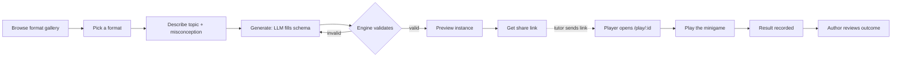

# UX definition (v1)

Purpose: define the screens and flows first, so the route map falls out of the
UX rather than being guessed. Framework-agnostic — paths here are logical, not
tied to Next.js/SvelteKit/etc. (that choice is still open; see Open questions).

Grounding: the engine's job is **fill, don't design** — pick a format
(a mechanic isomorphic to a concept), have the LLM fill its schema for one kid's
specific confusion, validate, render, play, review. The UX has to serve two
very different people on two very different surfaces.

## Actors

| Actor | Who | Surface | Cares about |
| --- | --- | --- | --- |
| **Author** | tutor / builder | desktop, logged-in | picking the right mechanic, describing the kid's misconception, getting a link |
| **Player** | the student | phone/tablet, **link only, no login** | playing something that just works; zero setup, zero account |
| **Reviewer** | tutor / parent | desktop, logged-in | "did the kid actually do it, and how did they do" |

Author and Reviewer are usually the same person at different moments. The
Player surface must be **anonymous and shareable** — a kid opens a link their
tutor sent; no account, COPPA-friendly.

## The core loop

The generate→validate loop is the load-bearing part: a hallucinated item fails
schema validation and regenerates, so the author never ships a broken game.

## Screen inventory

Each screen lists its **purpose**, **key elements**, and the **store methods**
it reads/writes (from `src/db/store.ts`), so the API surface is unambiguous.

### 1. Format gallery — the author's home
- **Purpose:** browse the mechanic library (the moat). Entry point.
- **Key elements:** grid of format cards (name, concept class, a tiny live
  demo/thumbnail), "generate from this" CTA per card.
- **Store:** `allFormats()`.

### 2. Format detail
- **Purpose:** understand one mechanic before generating — what concept it's
  isomorphic to, what its slots are, a sample instance.
- **Key elements:** spec summary, a playable sample, "generate for a student" CTA.
- **Store:** `getFormat(id)`.

### 3. Authoring / generate
- **Purpose:** the heart of the author flow. Turn "this kid confuses X" into a
  playable instance.
- **Key elements:** chosen format, **topic** field, **misconception** field,
  Generate button → live preview of the generated game → Save → **share link**.
  Regenerate if the preview isn't right.
- **Store:** `insertInstance(...)` (after the engine's LLM-fill + validation, a
  backend concern — the screen just POSTs topic + misconception).

### 4. Play — the player surface
- **Purpose:** the shareable, anonymous minigame. What the kid actually opens.
- **Key elements:** full-bleed canvas game, minimal chrome, no login. A
  lightweight `student_id` (from the link or a first-run prompt) tags results.
  On completion, submit the outcome.
- **Store:** `getInstance(id)` to load; `insertResult(...)` on finish.

### 5. Instances — author's generated list
- **Purpose:** find and re-share instances you've made.
- **Key elements:** list of instances (format, topic, misconception, created,
  play count), each linking to its detail + share link.
- **Store:** ⚠️ **gap** — needs an `allInstances()` (or by-author) read; today
  we only have `instancesByFormat(formatId)`. See Open questions.

### 6. Instance detail + results — the reviewer surface
- **Purpose:** "did the kid do it, and how." Also where the share link lives.
- **Key elements:** the instance, its share link, a table of results
  (student, score, when), per-item breakdown from `detail`.
- **Store:** `getInstance(id)`, `resultsForInstance(id)`.

### 7. Student progress (optional, later)
- **Purpose:** one learner across many instances.
- **Store:** `resultsForStudent(id)`.

## Route map

Logical routes derived from the screens above, with the backing API + store
calls. Page routes are what the framework choice will shape; API routes back
onto the store as-is.

| Screen | Page route | API route | Store method |
| --- | --- | --- | --- |
| Format gallery | `/` | `GET /api/formats` | `allFormats()` |
| Format detail | `/formats/:formatId` | `GET /api/formats/:formatId` | `getFormat()` |
| Authoring / generate | `/formats/:formatId/new` | `POST /api/formats/:formatId/instances` | `insertInstance()` (post-validate) |
| Play (player) | `/play/:instanceId` | `GET /api/instances/:instanceId` · `POST /api/instances/:instanceId/results` | `getInstance()` · `insertResult()` |
| Instances list | `/instances` | `GET /api/instances` | `allInstances()` ⚠️ *to add* |
| Instance detail + results | `/instances/:instanceId` | `GET /api/instances/:instanceId/results` | `getInstance()` · `resultsForInstance()` |
| Student progress (later) | `/students/:studentId` | `GET /api/students/:studentId/results` | `resultsForStudent()` |

Only `/play/:instanceId` is public/anonymous. Everything else is behind the
author's login.

## What this tells the backend

- One store gap to close before the Instances list screen: **`allInstances()`**
  (or `instancesByAuthor`, once authorship exists).
- The generate route (`POST /api/formats/:formatId/instances`) is the only one
  that isn't a thin store pass-through — it runs the LLM-fill + schema
  validation (the engine) before `insertInstance`.
- Everything else is a direct map onto methods already in `src/db/store.ts`,
  which is a good sign the store interface fits the UX.

## Open questions (decide before wiring routes)

1. **Framework** — Next.js (React) colocates these API routes with the existing
   Node store and gives SSR share links for free; alternatives are a Vite+React
   SPA with a separate API server, or SvelteKit. Undecided.
2. **v1 scope** — minimum is screens **3 + 4** (generate + play): enough to hand
   a real kid a real game and test the isomorphism thesis. The gallery (1),
   instances list (5), and results (6) are what make hand-testing comfortable
   but aren't required to validate the thesis.
3. **Player identity** — how `student_id` is assigned on the anonymous play
   surface (embedded in the share link? first-run nickname prompt?). Affects the
   `/play` route shape.
4. **Author auth** — out of scope for a hand-tested v1, but the route map
   assumes everything except `/play` eventually sits behind a login.
