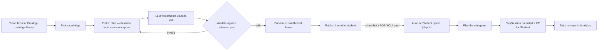

# UX definition (v1)

> **Ground truth:** [`TECH_SPEC.md`](./TECH_SPEC.md) is the canonical technical
> spec. This document defines the screens and flows; wherever the two disagree,
> the tech spec wins. In particular this doc uses the tech spec's vocabulary —
> **Cartridge** (the mechanic/engine, formerly "format"), **Game** (a filled
> instance, formerly "instance"), **PlaySession** (a play outcome, formerly
> "result") — and its actor model (**Anon / Student / Tutor**, §5).

Purpose: define the screens and flows so the route map falls out of the UX
rather than being guessed. Framework decided (Next.js App Router, see
`TECH_SPEC.md` §1); paths here are logical.

Grounding: the engine's job is **fill, don't design** — pick a cartridge
(a mechanic isomorphic to a concept), have the LLM fill its schema for one kid's
specific confusion, validate, render, play, review (`TECH_SPEC.md` §3.6, §4).
The UX serves three actors across two very different surfaces.

## Actors

Per `TECH_SPEC.md` §5 — role is fixed per account (the demo `[ANON][STUDENT][TUTOR]`
toggle is scaffolding, not a real feature).

| Actor | Auth | Surface | Cares about | Gated screens |
| --- | --- | --- | --- | --- |
| **Anon** | none (no token) | phone/tablet, **link only** | playing something that just works; zero setup, zero account | Arcade (public), `/play/:id` |
| **Student** | JWT `role=student` | logged-in | XP, rank, "made for me" games | Arcade (+ FOR YOU! cards), XP, Rankings, Profile |
| **Tutor** | JWT `role=tutor` | desktop, logged-in | picking the right cartridge, describing the misconception, "did the kid do it" | Editor, Catalog (Mine/Marketplace), Analytics |

The old Author/Reviewer roles both collapse into **Tutor** (author and reviewer
are the same person at different moments). The old Player role splits into
**Anon** (no account, COPPA-friendly link play) and **Student** (logged-in, earns
XP). The Anon play surface stays anonymous and shareable — a kid opens a link
their tutor sent; on an anon play `PlaySession.player_id = null` (§5).

## The core loop

The generate→validate loop is the load-bearing part (`TECH_SPEC.md` §3.6): the
LLM is called with `schema_json` as a **tool definition**, so it can only emit
arguments matching the schema; the result is validated server-side anyway
(defense in depth). A bad fill never reaches the preview pane — it stays in the
chat retry loop while the preview keeps its last-valid state.

## Screen inventory

Screens mirror `TECH_SPEC.md` §3. Each lists its **purpose**, **actors**, and the
**API route(s)** that back it.

### 1. Arcade (Anon / Student) — §3.1
- **Purpose:** the public game shelf; entry point for players.
- **Elements:** grid of `GameCard`s (title + joined `Cartridge.name` for the
  "fmt:" meta line). Students also see FOR YOU! cards (games where
  `target_student_id = me`); anon sees none.
- **API:** `GET /api/games?visibility=public&status=published`.

### 2. XP (Student) — §3.2
- **Purpose:** the student's own XP total, streak, and recent events.
- **Elements:** total, streak, recent `XPEvent` list. Server computes deltas
  from `XP_RULES`; `daily_login` fires once per calendar day server-side.
- **API:** `GET /api/xp/summary`, `POST /api/xp/events`.

### 3. Rankings (Student) — §3.3
- **Purpose:** leaderboards at local / country / global scope.
- **Elements:** top 10 (Redis `ZREVRANGE`) plus the caller's own rank
  (`ZRANK`), always appended even if outside the top 10.
- **API:** `GET /api/rankings/{scope}` (`local|country|global`).

### 4. Profile (Student) — §3.4 (mockup-only)
- **Purpose:** display-only identity + XP summary + hardcoded badges.
- **API:** `GET /api/profile/{user_id}`. **No write endpoint exists** — display-only
  means no PATCH/PUT, not just no UI.

### 5. Editor (Tutor) — §3.5–§3.7
- **Purpose:** the heart of the author flow — turn "this kid confuses X" into a
  playable Game, on top of a chosen Cartridge.
- **Elements:**
  - **Cartridge / game load (§3.5):** pick a cartridge (`scope=mine|library|marketplace`),
    create a draft Game. `access_level(user, cartridge)` = FULL for the author,
    INSTANCE_ONLY otherwise — gates whether schema/engine-edit controls show at
    all (enforced server-side, not just hidden).
  - **Chat + generation (§3.6):** a **streaming chat** (SSE). Each message runs
    the LLM-fill → validate → write-on-valid flow and streams status back.
  - **Live preview (§3.7):** a **sandboxed iframe** (`sandbox="allow-scripts"`,
    no `allow-same-origin`) running the cartridge's shared engine bundle, fed
    instance data via `postMessage` — one runtime, hot-swappable disks.
- **API:** `GET /api/cartridges?scope=…`, `POST /api/games`, `POST /api/cartridges`,
  `POST /api/games/{id}/chat` (SSE).

### 6. Catalog — Mine / Marketplace (Tutor) — §3.8
- **Purpose:** find and re-share your Games; browse public ones; fork (mod) any.
- **Elements:** Mine vs Marketplace toggle. Marketplace list items carry a
  second author reference — the "cartridge by:" credit (join to
  `Cartridge.author_id`), kept distinct from `Game.owner_id`.
- **API:** `GET /api/games?owner_id=me` (Mine),
  `GET /api/games?visibility=public&sort=top` (Marketplace),
  `POST /api/games/{id}/mod` (fork → new Game with `modded_from_id` set).

### 7. Analytics (Tutor) — §3.9
- **Purpose:** "did the kid do it, and how" — per-game and per-cartridge rollups.
- **Elements:** per-game plays / MAU / rating / completion / replay / mods_spawned;
  per-cartridge cross-owner rollup (author-only, 403 otherwise).
- **API:** `GET /api/analytics/games/{id}`, `GET /api/analytics/cartridges/{id}`.

## Route map

Logical page routes derived from the screens above (see `TECH_SPEC.md` §6 for the
target `/screens/{anon,student,tutor}/…` component layout), with the backing API
routes from §3.

| Screen | Page route | API route |
| --- | --- | --- |
| Arcade | `/` (anon) · `/app` (student) | `GET /api/games` |
| XP | `/xp` | `GET /api/xp/summary` · `POST /api/xp/events` |
| Rankings | `/rankings` | `GET /api/rankings/{scope}` |
| Profile | `/profile/:userId` | `GET /api/profile/{user_id}` |
| Editor | `/editor` · `/editor/:gameId` | `GET /api/cartridges` · `POST /api/games` · `POST /api/games/{id}/chat` |
| Catalog | `/catalog` | `GET /api/games?owner_id=me` · `GET /api/games?visibility=public&sort=top` · `POST /api/games/{id}/mod` |
| Analytics | `/analytics/games/:gameId` · `/analytics/cartridges/:cartridgeId` | `GET /api/analytics/games/{id}` · `GET /api/analytics/cartridges/{id}` |
| Play (player) | `/play/:gameId` | `GET /api/games/:id` · `POST /api/games/:id/sessions` |

Only `/` (anon Arcade, public reads) and `/play/:gameId` are public/anonymous.
Everything else sits behind the JWT login (§5).

## What this tells the backend

- **Authorship & lineage first (§8 step 1).** `Cartridge.author_id` (immutable),
  `Game.owner_id`, and `Game.modded_from_id` (self-ref) are the integrity spine —
  the DB enforces them, and every screen above assumes they exist.
- **The generate route is the only non-pass-through.** `POST /api/games/{id}/chat`
  runs LLM-fill (tool-use) + schema validation before writing
  `Game.instance_data_json`; everything else is a thin read/write.
- **Anon is `null`, not a magic string.** PlaySession `player_id` is nullable;
  MAU excludes anon by definition (§5).

## Open questions (most now decided by TECH_SPEC.md)

1. **Framework** — ✅ Decided: Next.js App Router (`TECH_SPEC.md` §1).
2. **v1 scope / build order** — ✅ Sequenced in `TECH_SPEC.md` §8: schema →
   Anon Arcade + one cartridge end-to-end → Student auth/XP/Rankings → Editor →
   Catalog/mod → Analytics.
3. **Player identity** — how a Student `player_id` is attached on the `/play`
   surface (embedded in the share link vs. first-run prompt) is still open; anon
   plays are simply `player_id = null`.
4. **`daily_login` timezone** — server TZ vs user TZ must be pinned and
   documented (`TECH_SPEC.md` §3.2 flags this as a real bug source).
